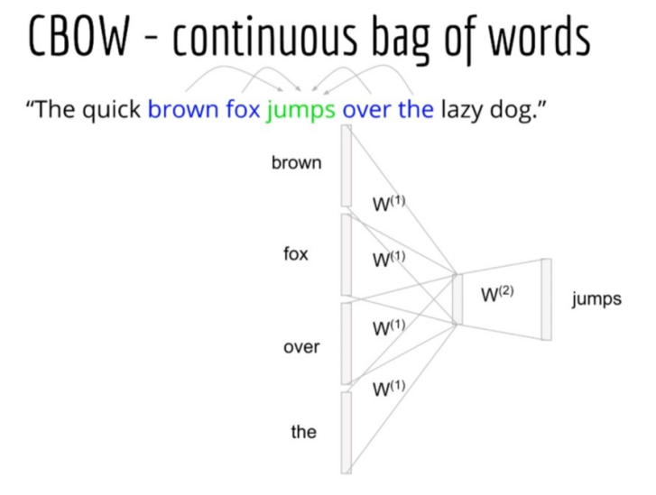

# CBOW (continuous bag of words)
 - CBOW (continuous bag of words ) predicts the target word (the word in the center) from the surrounding   
   context words (the words before and after the target word in a sentence). It uses a LSTM .

## Dataset
- People Wikipedia Data contains URIs, names of people and text from their wikipedia page.
- can download from https://www.kaggle.com/datasets/sameersmahajan/people-wikipedia-data

## Inference

## Ckeckpoint